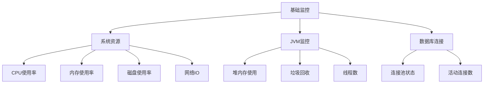
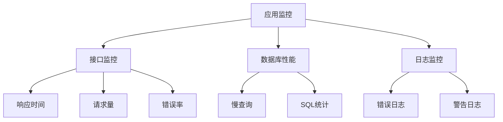
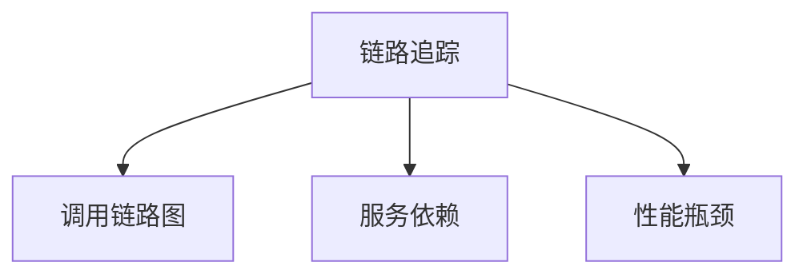
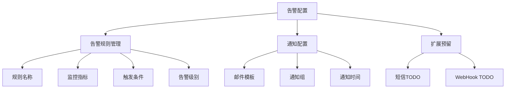
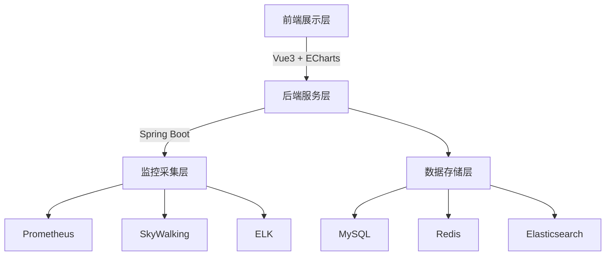
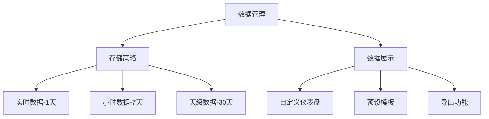

# 运维监控系统设计方案

## 1. 系统概述

本项目旨在构建一个综合的运维监控系统，集成多种监控工具，实现系统资源、应用性能、数据库性能等多维度的监控。

## 2. 功能架构

### 2.1 监控维度

#### 第一优先级（基础监控）


#### 第二优先级（应用监控）


#### 第三优先级（链路追踪）


### 2.2 告警管理



## 3. 技术架构

### 3.1 整体架构



### 3.2 数据管理策略



## 4. 实现计划

### 4.1 第一阶段（基础框架）- 2周

1. 基础环境搭建：
   - Spring Boot 项目初始化
   - Prometheus + Grafana 环境配置
   - 基础监控指标接入

2. 监控功能实现：
   - 系统资源监控（CPU、内存、磁盘）
   - JVM 监控
   - 数据库连接监控

3. 告警功能：
   - 邮件告警通知
   - 基础告警规则配置

4. 界面开发：
   - 监控仪表盘
   - 系统设置页面

### 4.2 第二阶段（应用监控）- 2周

1. 应用性能监控：
   - 接口响应时间监控
   - 请求量监控
   - 错误率统计

2. 数据库监控：
   - 慢查询监控
   - SQL性能分析
   - 连接池监控

3. 功能优化：
   - 告警规则动态配置
   - 自定义仪表盘
   - 数据导出功能

### 4.3 第三阶段（日志分析）- 1周

1. ELK集成：
   - 日志收集配置
   - 日志分析功能
   - 日志查询界面

2. 功能完善：
   - 链路追踪
   - 性能分析
   - 监控报表

## 5. 关键设计要点

### 5.1 数据采集

1. Prometheus采集：
```yaml
global:
  scrape_interval: 15s
  evaluation_interval: 15s

scrape_configs:
  - job_name: 'spring-boot'
    metrics_path: '/actuator/prometheus'
    static_configs:
      - targets: ['localhost:8080']
```

2. 日志采集：
```yaml
filebeat.inputs:
- type: log
  enabled: true
  paths:
    - /path/to/logs/*.log
```

### 5.2 告警规则示例

```json
{
  "name": "CPU使用率告警",
  "metric": "system_cpu_usage",
  "condition": ">",
  "threshold": 80,
  "duration": "5m",
  "severity": "warning",
  "notifications": [
    {
      "type": "email",
      "template": "cpu_alert",
      "receivers": ["admin@example.com"]
    }
  ]
}
```

### 5.3 数据展示

1. 仪表盘配置：
```javascript
const dashboardConfig = {
  layout: 'grid',
  widgets: [
    {
      type: 'chart',
      title: 'CPU使用率',
      metric: 'system_cpu_usage',
      chartType: 'line'
    },
    {
      type: 'gauge',
      title: '内存使用率',
      metric: 'system_memory_usage'
    }
  ]
}
```

## 6. 项目亮点

1. 技术集成：
   - 综合运用 Prometheus、Grafana、SkyWalking、ELK 等主流监控工具
   - 展现对监控技术栈的掌握程度

2. 性能优化：
   - 采用分层存储策略
   - 实现数据合理归档
   - 优化查询性能

3. 实用功能：
   - 自定义仪表盘
   - 灵活的告警配置
   - 完善的数据导出

4. 扩展性：
   - 预留告警通知扩展
   - 监控指标可配置
   - 支持自定义监控

## 7. 注意事项

1. 数据存储：
   - 合理设置数据保留期限
   - 定期数据归档
   - 防止数据量过大影响性能

2. 性能考虑：
   - 监控数据采集间隔合理配置
   - 合理使用缓存
   - 避免过度监控

3. 实用性：
   - 监控指标要有实际意义
   - 告警阈值要合理
   - 保证监控数据可用性

## 8. 未来优化方向

1. 功能扩展：
   - 支持更多告警方式
   - 添加智能告警
   - 监控数据分析

2. 性能优化：
   - 数据采集性能优化
   - 查询性能优化
   - 存储优化

3. 可用性提升：
   - 监控系统高可用
   - 数据备份机制
   - 故障自恢复
