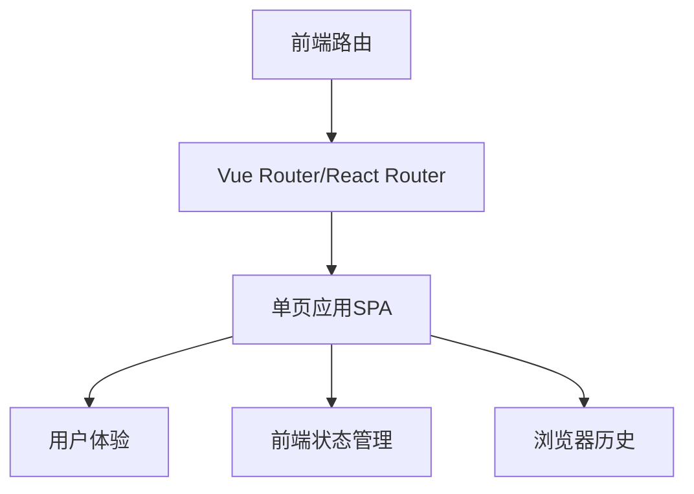
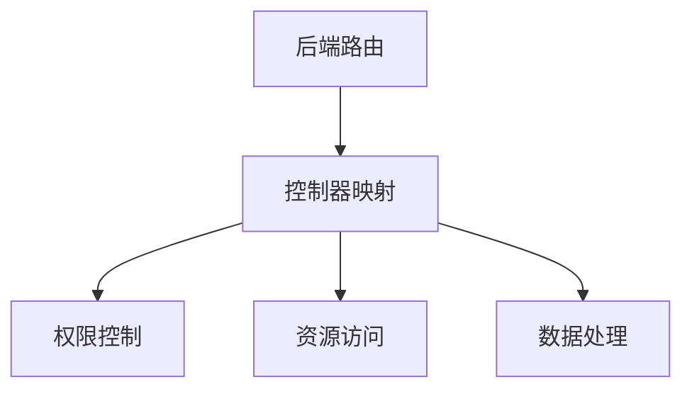
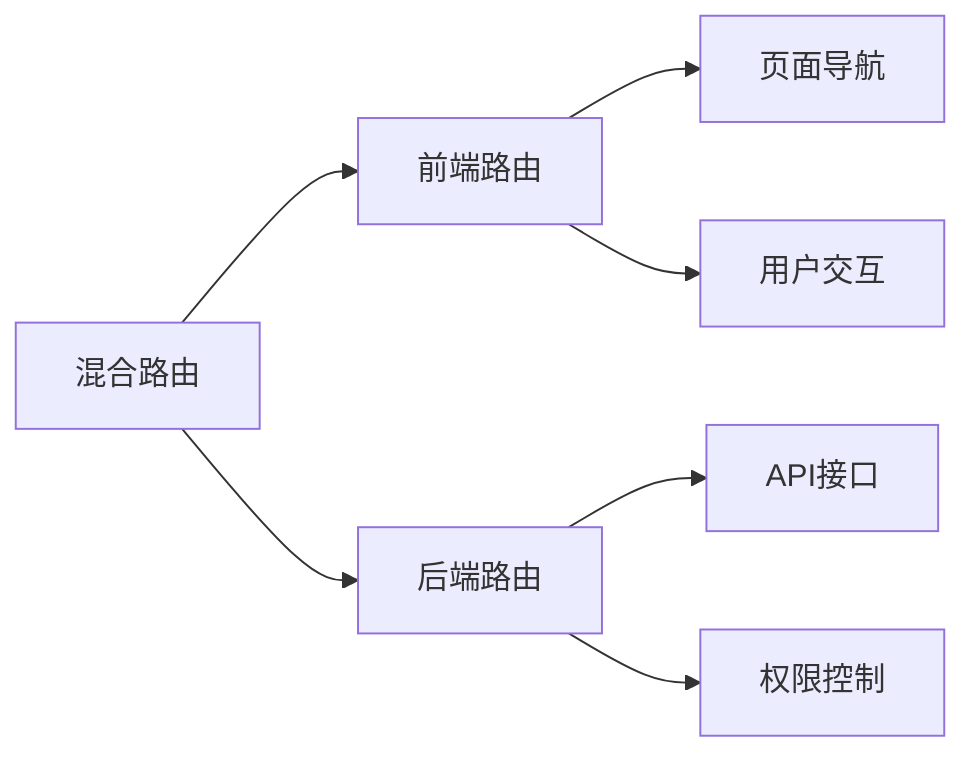

# 路由设计与国际化实现方案

## 1. 路由设计方案

### 1.1 路由类型

#### 前端路由


适用场景：
- 内容展示型网站
- 用户交互密集的应用
- 重视用户体验的场景

优势：
- 无刷新页面切换
- 更好的用户体验
- 前端状态管理
- 降低服务器压力

#### 后端路由


适用场景：
- 传统的企业应用
- 需要严格权限控制的系统
- 服务端渲染场景

优势：
- 安全性更高
- 便于权限控制
- 利于SEO
- 后端统一管理

### 1.2 混合路由策略

在现代应用中，可以采用混合路由策略，结合两种路由的优势：



实现方式：
```java
// 后端API路由
@RestController
@RequestMapping("/api")
public class ApiController {
    @GetMapping("/data")
    public R getData() {
        return R.success(data);
    }
}

// 前端路由配置
const routes = [
    {
        path: '/dashboard',
        component: Dashboard,
        children: [
            {
                path: 'analysis',
                component: Analysis
            }
        ]
    }
];
```

## 2. 国际化实现方案

### 2.1 后端国际化

#### 配置实现
```java
@Configuration
public class I18nConfig {
    @Bean
    public LocaleResolver localeResolver() {
        SessionLocaleResolver slr = new SessionLocaleResolver();
        slr.setDefaultLocale(Locale.CHINA);
        return slr;
    }
    
    @Bean
    public LocaleChangeInterceptor localeChangeInterceptor() {
        LocaleChangeInterceptor lci = new LocaleChangeInterceptor();
        lci.setParamName("lang");
        return lci;
    }
}
```

#### 资源文件
```properties
# messages_zh_CN.properties
user.name=用户名
user.password=密码

# messages_en_US.properties
user.name=Username
user.password=Password
```

#### 使用示例
```java
@Autowired
private MessageSource messageSource;

public String getMessage(String code) {
    return messageSource.getMessage(code, null, LocaleContextHolder.getLocale());
}
```

### 2.2 前端国际化

#### Vue实现
```javascript
// i18n配置
import Vue from 'vue'
import VueI18n from 'vue-i18n'

Vue.use(VueI18n)

const messages = {
  en: {
    menu: {
      dashboard: 'Dashboard',
      user: 'User Management'
    }
  },
  zh: {
    menu: {
      dashboard: '仪表盘',
      user: '用户管理'
    }
  }
}

const i18n = new VueI18n({
  locale: 'zh',
  messages
})
```

#### React实现
```javascript
// 使用react-i18next
import { useTranslation } from 'react-i18next';

function MyComponent() {
  const { t } = useTranslation();
  
  return (
    <div>
      <h1>{t('menu.dashboard')}</h1>
    </div>
  );
}
```

### 2.3 菜单国际化最佳实践

#### 2.3.1 数据库设计
```sql
CREATE TABLE sys_menu (
    menu_id BIGINT PRIMARY KEY,
    menu_key VARCHAR(50) NOT NULL,    -- 国际化key
    icon VARCHAR(100),
    parent_id BIGINT,
    order_num INT,
    path VARCHAR(200),
    component VARCHAR(255),
    -- other fields
);
```

#### 2.3.2 前端实现
```javascript
// 菜单配置
const menuConfig = {
  'menu.system': {
    zh: '系统管理',
    en: 'System'
  },
  'menu.system.user': {
    zh: '用户管理',
    en: 'User Management'
  }
};

// 菜单渲染
function renderMenu(menuData) {
  return menuData.map(item => ({
    ...item,
    title: i18n.t(item.menu_key)
  }));
}
```

#### 2.3.3 框架集成
```typescript
// 菜单服务
@Service()
export class MenuService {
    async getUserMenus(userId: number) {
        const menus = await this.menuRepository.getUserMenus(userId);
        return menus.map(menu => ({
            ...menu,
            name: menu.menu_key  // 使用key而不是固定文本
        }));
    }
}
```

## 3. 渐进式实现建议

### 3.1 基础实现
- 仅前端路由
- 简单的前端国际化
- 基本的权限控制

### 3.2 标准实现
- 前后端混合路由
- 完整的国际化支持
- RBAC权限控制

### 3.3 高级实现
- 动态路由
- 多语言动态加载
- 细粒度权限控制

## 4. 注意事项

1. 路由设计
   - URL语义化
   - 合理的层级结构
   - 权限控制粒度
   - 性能考虑

2. 国际化实现
   - 文案规范
   - 动态加载
   - 缓存策略
   - 默认语言处理

3. 性能优化
   - 路由懒加载
   - 语言包按需加载
   - 缓存合理使用
